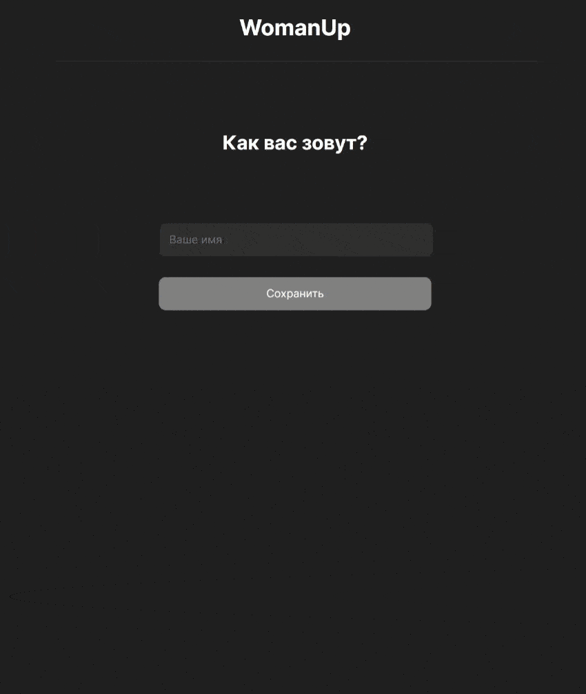

# Чат приложение на React и FireBase


## Описание
SPA приложение — чат на React и FireBase.</br>
[Деплой](https://react-simple-chat.rizametov.com/)

## Стек
* React
* JavaScript
* FireBase
* HTML5
* CSS

## Установка
Для запуска на локальной машине необходимо:
1. Установить зависимости
```sh
npm install
```

2. Добавить файл конфигурации fireBaseConfig.js в папку /src/firebase/ . Файл должен содержать конфигурацию в следующем формате:

```sh
export const CONFIG = {
  apiKey: 'Данные из вашего аккаунта в FireBase',
  authDomain: 'Данные из вашего аккаунта в FireBase',
  projectId: 'Данные из вашего аккаунта в FireBase',
  storageBucket: 'Данные из вашего аккаунта в FireBase',
  messagingSenderId: 'Данные из вашего аккаунта в FireBase',
  appId: 'Данные из вашего аккаунта в FireBase',
};
```

3. Запустить в режиме разработки:</br>
```sh
npm run start
```
Если все прошло успешно, проект будет запущен на `http://localhost:3000`

## Превью
